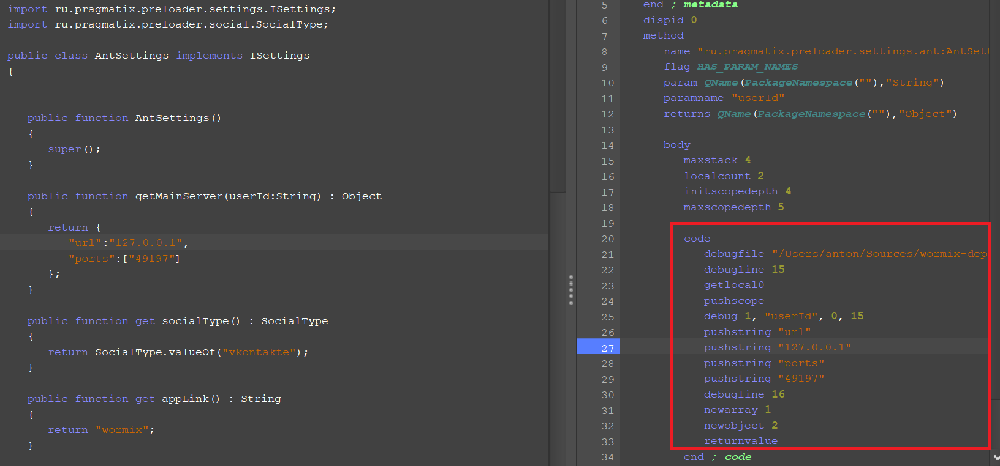
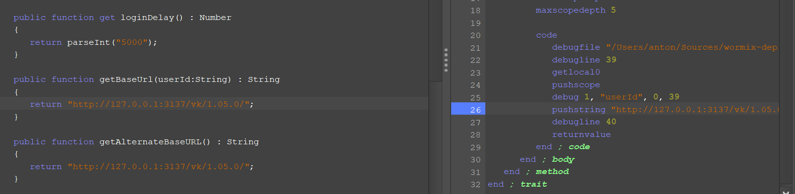

# Установка локального севера

## Некоторая информация

Данный модуль представляет из себя локальный сервер для вормикса.
В его задачи входит обработка команд от сервера,
однако данный модуль не занимается работой с БД (хотя соответствующие интерфейсы присутствуют).

Сервер состоит из четырех основных (под-)серверов
1. Главный сервер - отвечает за покупки, авторизацию, миссии и т.д.
2. PvP сервер - отвечает за PvP режим
3. Сервер достижений - отвечает за достижения :)
4. Клановый сервер - занимается работой с кланами

Архитектура модуля позволяет развернуть сервера на разных нодах.

## Настройка и запуск

Для полноценной работы необходим модуль wormix-api - он отвечает за работу с БД.
Если все запускать на локальном устройстве,
то достаточно просто запустить wormix-api (c настройкой) и wormix-core,
передав в качестве аргумента запуска путь к конфигу.
Пример конфига находится в папке [configs](../configs/network_example.json)
Для локального запуска ничего менять не надо. Он подходит.

## Что можно изменить
Для развертывания на своем сервер надо будет отредактировать preloader.swf.
Для редактирования понадобится [JPEXS Free Flash Decompiler](https://github.com/jindrapetrik/jpexs-decompiler/releases)
Изменять надо следующие файлы
1. AntSettings - находится в пакете ru.pragmatix.preloader.settings.ant
2. AntWormixSettings - находится в пакете ru.pragmatix.wormix.common

**ВАЖНО! Редактировать надо именно P-code, а не ActionScript, иначе все может сломаться**

В файле AntSettings надо отредактировать следующие функции
1. getMainServer - возвращает значение главного сервера игры
2. getBaseUrl - тут можно сменить путь, по умолчанию клиент игры разворачивается локально
3. getAlternateBaseURL - вписываем тоже самое, что и в getBaseUrl.

 

В файле AntWormixSettings надо отредактировать следующие функции

1. getPvpServer - возвращает значение PvP сервера
2. getAchievementServer - возвращает значение сервера достижений
3. getClanServer - возвращает значение кланового сервера

**Незабываем, что если изменять порты в прелоадере, то надо изменить порты и в конфиге**

## Описание конфигурационного файла
| Поле      | Описание                                                                                                              |
|-----------|-----------------------------------------------------------------------------------------------------------------------|
| local     | Сервера будут разворачиваться локально, если поле указано в `true`, то сервер развернется на 0.0.0.0                  |
| servers   | Массив серверов. Поле enabled в каждом сервере отвечает за то, включать ли сервер или нет. Порт можно указывать любой |
| provider  | Обработчик, который будет заниматсья работой с БД и игровой логикой (реализован только http)                          |
| providers | Список провайдеров, для http необходимо указать url без /. Это URL сервера wormix-api                                 |

## ???

В целом все, дополнительной настройки модуль не требует, можно развлекаться :)
